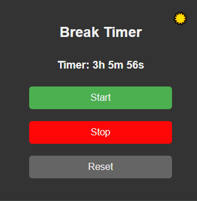
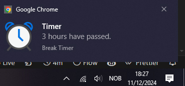
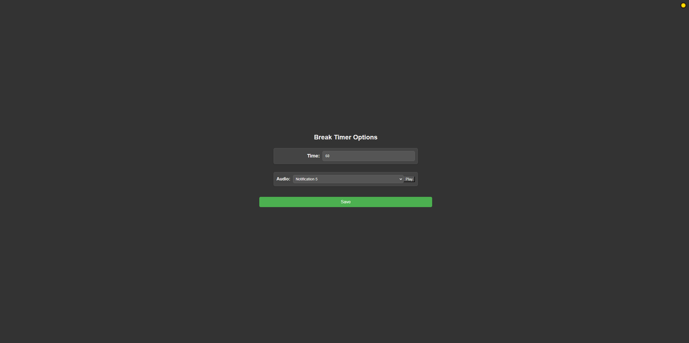

Break Timer
===========
A simple break timer for reminding you to take breaks while working on your computer.

It is a simple chrome extension that you can install and set the time interval for which you want to work before taking a break. It will remind you to take a break after the set time interval. 

I also added some different sounds that you can choose from for the reminder. All the notification sounds are from Pixabay, collected from the users: RasoolAsaad and BenKirb. You can choose between the options on the extension's options page. This is also where you can set the time interval for the break reminder, the default is 60 minutes.

PS: If you want to also have sounds for the notifications, you need to set the notification sound in the options page of the extension, and because of how chrome extensions work, the options page will need to be open in a tab for the sounds to work.